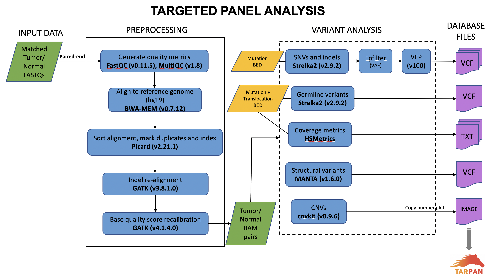

# Targeted-Panel-Analysis
Targeted sequencing introduces an enrichment step where specific genes or gene regions are selectively amplified using gene panels in a simple PCR reaction. Targeted gene sequencing panels are useful tools for analyzing specific mutations in a given sample. Focused panels contain a select set of genes or gene regions that have known or suspected associations with the disease or phenotype under study. Paired end fastq files from matched tumor and germline samples are need for this analysis.
The entire pipeline is divided into 3 steps: Preprocessing, Variant Analysis and Targeted sequencing panel Viewer. This workflow is effective for large-scale batch processing. Preprocessing and variant analysis are performed in HPC clusters with Torque system.

# The software used in this pipeline are:
#### Preprocessing: 
- [FastQC](https://www.bioinformatics.babraham.ac.uk/projects/fastqc)
- [MultiQC](https://multiqc.info/)
- [BWA-MEM](http://bio-bwa.sourceforge.net/)
- [Picard-v2.10.0](https://github.com/broadinstitute/picard/releases/tag/2.10.0)
- [GATK3](https://console.cloud.google.com/storage/browser/gatk-software/package-archive/gatk) – for indel realignment
- [GATK4](https://github.com/broadinstitute/gatk/releases/tag/4.1.4.0)
 
#### Variant Analysis:
- [Strelka](https://github.com/Illumina/strelka/releases/tag/v2.9.2)
- [MANTA](https://github.com/Illumina/manta/releases/tag/v1.6.0)
- [fpfilter](https://github.com/ckandoth/variant-filter)
- [bam-readcount](https://gist.github.com/ckandoth/87ba44948cb747916f8d#file-build_bam_readcount-txt)
- [VEP-v101.0](http://grch37.ensembl.org/info/docs/tools/vep/script/vep_download.html#installer)
- [cnvkit](https://cnvkit.readthedocs.io/en/stable/quickstart.html)
 #### For [TarPan Viewer](https://github.com/parvathisudha/tarpan)
- [SQLite](https://www.sqlite.org/index.html)
- [DB Viewer](https://sqlitebrowser.org/)
- [R](https://www.r-project.org/)
- [R Shiny](https://shiny.rstudio.com/)
- [RStudio](https://www.rstudio.com/) - easiest way to implement using this IDE
- [Python](https://www.python.org/)
 
